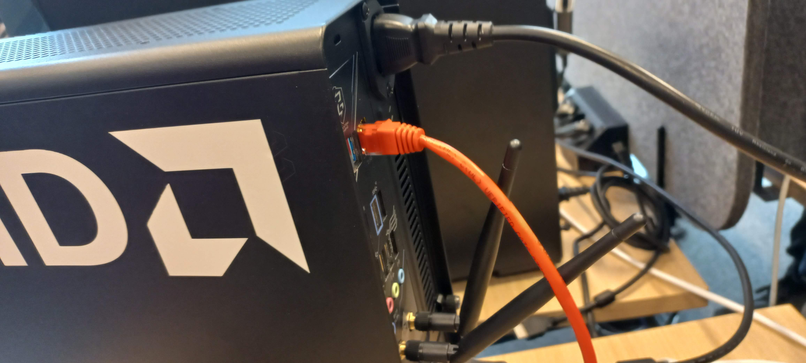
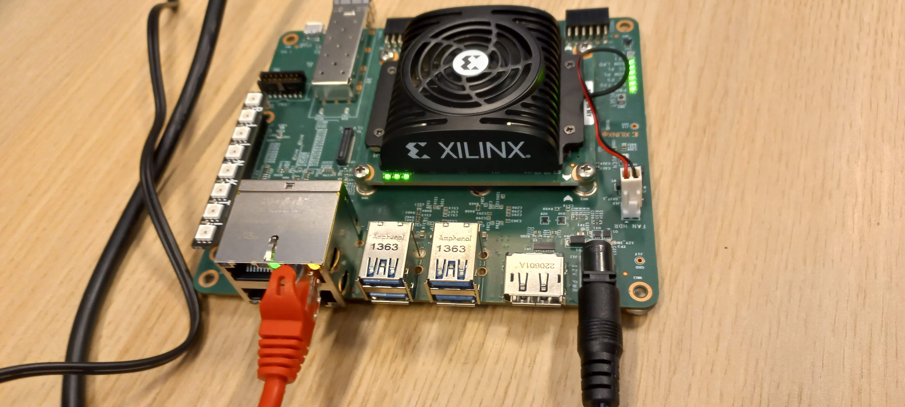

# Warning

This Readme is intended for setting up demo with specific hardware using prebuilt images.


# Wiring




# Verify connectivity

Kria and x86 has static IP address set.
```bash
# ping Kria
ping 192.168.99.1
```

ssh to Kria
```
ssh kria # which is  ssh mpelka@192.168.99.1

```
Password is:
```
qwerty123
```
# Load app
We need to do that every restart of Kria board.
```bash
# at kria after ssh with:
# ssh kria
sudo xmutil listapps
sudo xmutil unloadapp 
sudo xmutil loadapp stereolbm_accel
```
# Start demo run
Start app at Kria:
```bash
# at kria board after ssh:
# ssh kria
source /home/$USER/krs_ws/install/setup.bash
cd /home/$USER/stereolbm_accel
./stereolbm_accel_tb
```

Start simulator:
```bash
# at x86 in terminal1
hil_Game_loop
```

Start depth viewer:
```bash
# at x86 in terminal 2 
hil_DepthViewer
```

Start rqt:
```bash
# at x86 in terminal 3:
rqt
``


