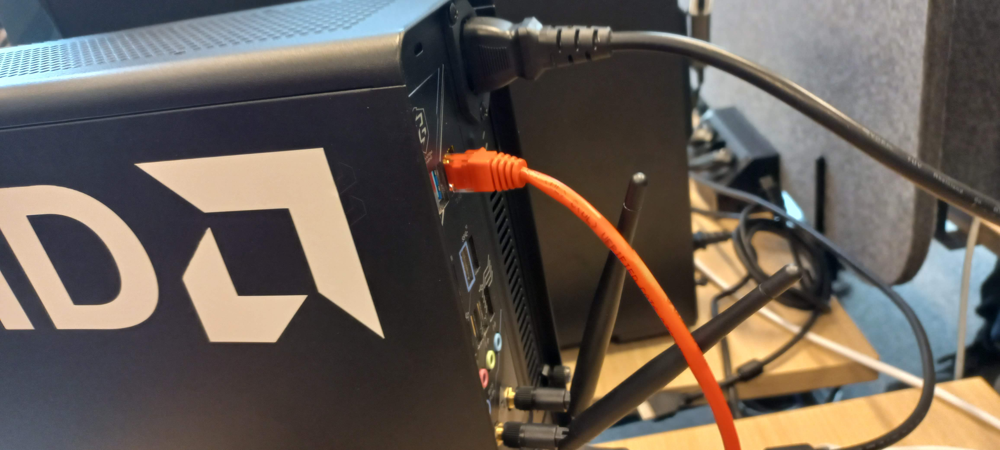

# Warning

This Readme is intended for setting up demo with specific hardware using prebuilt images.
Please refer to [Readme](../../README.md) fo generic build 

# Wiring




# Setup PC

## Setup IP of ethernet interfaces

Open Ubuntu Network Manager and adjust to following:


**Note : you need to reconnect cable to changes take place**

Verify ip adress for chose adapter with `ip addr`.
You should see `192.168.99.2/24` in output :

```bash
user@robo-pc-119:~$ ip addr
1: lo: <LOOPBACK,UP,LOWER_UP> mtu 65536 qdisc noqueue state UNKNOWN group default qlen 1000
    link/loopback 00:00:00:00:00:00 brd 00:00:00:00:00:00
    inet 127.0.0.1/8 scope host lo
       valid_lft forever preferred_lft forever
    inet6 ::1/128 scope host 
       valid_lft forever preferred_lft forever
2: enp14s0: <BROADCAST,MULTICAST,UP,LOWER_UP> mtu 1500 qdisc fq_codel state UP group default qlen 1000
    link/ether 34:5a:60:33:18:7b brd ff:ff:ff:ff:ff:ff
    inet 192.168.99.2/24 brd 192.168.99.255 scope global noprefixroute enp14s0
       valid_lft forever preferred_lft forever
    inet6 fe80::3a1d:f77a:d42d:5a27/64 scope link noprefixroute 
       valid_lft forever preferred_lft forever
3: wlp15s0: <BROADCAST,MULTICAST,UP,LOWER_UP> mtu 1500 qdisc noqueue state UP group default qlen 1000
    link/ether c8:a3:e8:5b:3e:23 brd ff:ff:ff:ff:ff:ff
    inet 172.16.0.55/23 brd 172.16.1.255 scope global dynamic noprefixroute wlp15s0
       valid_lft 5938sec preferred_lft 5938sec
    inet6 fe80::65df:3b2b:cf31:ddab/64 scope link noprefixroute 
       valid_lft forever preferred_lft forever
```

Copy ssh keys to Kria board:
```
# run `ssh-keygen` if needed,
ssh-copy-id mpelka@192.168.99.1  #password is `qwerty123`
```

Setup file `~/.ssh/config`:

```
touch ~/.ssh/config
chmod 600 ~/.ssh/config
vim ~/.ssh/config
```
and adjust content:

```
Host kria
    HostName 192.168.99.1
    User mpelka
```

Verify if you can ssh to Kria board
```
ssh kria
```

## DDS

Create a file `kria_cyclone.xml` in home directory.
Adjust `enp114s0` to ethernet interface of your PC.
```
<?xml version="1.0" encoding="UTF-8" ?>
<CycloneDDS xmlns="https://cdds.io/config" xmlns:xsi="http://www.w3.org/2001/XMLSchema-instance" xsi:schemaLocation="https://cdds.io/config
https://raw.githubusercontent.com/eclipse-cyclonedds/cyclonedds/master/etc/cyclonedds.xsd">
    <Domain id="any">    
	<General>
		<Interfaces>
			<!-- Interface name below -->
			<NetworkInterface name="enp114s0"/>
		</Interfaces>
      	<AllowMulticast>default</AllowMulticast>
      	<MaxMessageSize>65500B</MaxMessageSize>
    	</General>
	<Internal>
		<SocketReceiveBufferSize min="10MB" max="default" />
		<Watermarks>
        		<WhcHigh>500kB</WhcHigh>
      		</Watermarks>
	</Internal>
	<Discovery>
		<Peers>
			<Peer address="192.168.99.1"/>
			<Peer address="192.168.99.2"/>
		</Peers>

      		<ParticipantIndex>auto</ParticipantIndex>
      		<MaxAutoParticipantIndex>1000</MaxAutoParticipantIndex>
    	</Discovery>
    </Domain>
</CycloneDDS>
```

According to `
Create file `/etc/sysctl.d/10-cyclone-max.conf` and add content:
```
net.core.rmem_max=2147483647

```

Please restart.


## Setup package with O3DE simulation

# Download and unzip O3DE game package

```bash
cd ~
wget https://robotec-ml-roscon2024-demos.s3.eu-central-1.amazonaws.com/KriaDepthDemo_roscondemo_jammyhumble_fab8e8.zip
unzip KriaDepthDemo_roscondemo_jammyhumble_fab8e8.zip
```

## Download workspace

```
cd ~
git clone https://github.com/RobotecAI/kria_depth_demo.git

```

## Setup Aliases

We will use aliases in `bashrc` to start sim, setup those carefully.

Add following alliases to `.bashrc`, **adjust `AMD Radeon RX 7800 XT (RADV GFX1101)` to fit your setup**!!

```bash
source /opt/ros/humble/setup.bash

export CYCLONEDDS_URI=file:///home/$USER/kria_cyclone.xml
export RMW_IMPLEMENTATION=rmw_cyclonedds_cpp
#export RMW_IMPLEMENTATION=rmw_fastrtps_cpp
export ROS_DOMAIN_ID=34

export WORKDIR=/home/$USER/KriaDepthDemo_roscondemo_jammyhumble_fab8e8/
export KRS_REPO=/home/$USER/kria_depth_demo/
source /opt/ros/humble/setup.bash
source $WORKDIR/ros2_ws/install/setup.bash

alias Game=${WORKDIR}/ROSCon2023DemoGamePackage/ROSCon2023Demo.GameLauncher -r_fullscreen=false -bg_ConnectToAssetProcessor=0 -r_width=960 -r_height=960 
alias hil_Game='${WORKDIR}/ROSCon2023DemoGamePackage/ROSCon2023Demo.GameLauncher -r_fullscreen=false -bg_ConnectToAssetProcessor=0 -r_width=960 -r_height=960 +LoadLevel levels/demostereo/demostereo.spawnable +r_displayInfo 0 --forceAdapter="AMD Radeon RX 7800 XT (RADV GFX1101)"'
alias hil_Fulscreen='${WORKDIR}/ROSCon2023Demo/Project/build/linux/bin/profile/ROSCon2023Demo.GameLauncher -r_fullscreen=true -bg_ConnectToAssetProcessor=0 +LoadLevel levels/demostereo/demostereo.spawnable +r_displayInfo 0 --forceAdapter="AMD Radeon RX 7800 XT (RADV GFX1101)'

alias hil_Game_loop='while true; do hil_Game; done'
alias hil_Editor=${WORKDIR}/ROSCon2023Demo/Project/build/linux/bin/profile/Editor
alias hil_DepthViewer='cd ${KRS_REPO}/scripts && python3 ${KRS_REPO}/scripts/view_disparity.py'
alias hil_RosNpcs='ros2 launch roscon2023_demo ROSCon2023Demo.launch.py ROS2Con2023Config:=${WORKDIR}/ROSCon2023Demo/ros2_ws/src/roscon2023_demo/config/ROSCon2023Config_stereoNPCS.yaml use_rviz:=true'
alias hil_O3DE_config='cmake -B ${WORKDIR}/ROSCon2023Demo/Project/build/linux -G "Ninja Multi-Config" -DLY_DISABLE_TEST_MODULES=ON -DLY_STRIP_DEBUG_SYMBOLS=ON'
alias hil_O3DE_build='cmake --build ${WORKDIR}/ROSCon2023Demo/Project/build/linux --config profile --target Editor ROSCon2023Demo.Assets ROSCon2023Demo.GameLauncher'
alias hil_kria_start="source /home/$USER/krs_ws/install/setup.bash && cd /home/$USER/stereolbm_accel && ./stereolbm_accel_tb"
alias hil_ssh_kria="ssh kria -t 'bash -ic \"hil_kria_start>>/dev/null\"'"
```

Install ROS 2 humble accrording to [manual](https://docs.ros.org/en/humble/Installation/Ubuntu-Install-Debs.html)

Install packages:
```
sudo apt-get install ros-humble-pilz-industrial-motion-planner ros-humble-rmw-cyclonedds-cpp ros-${ROS_DISTRO}-ackermann-msgs ros-${ROS_DISTRO}-control-toolbox ros-${ROS_DISTRO}-nav-msgs ros-${ROS_DISTRO}-gazebo-msgs ros-${ROS_DISTRO}-vision-msgs ros-${ROS_DISTRO}-ur-msgs ros-${ROS_DISTRO}-moveit-servo ros-${ROS_DISTRO}-moveit-visual-tools ros-${ROS_DISTRO}-moveit ros-${ROS_DISTRO}-pilz-industrial-motion-planner ros-${ROS_DISTRO}-controller-manager ros-${ROS_DISTRO}-ur-client-library ros-${ROS_DISTRO}-nav2-common ros-${ROS_DISTRO}-navigation2 libopencv-dev
```

Build ROS 2 workspace:
```
source ~/.bashrc
cd $WORKDIR/ros2_ws
./setup_submodules.bash
sudo apt install python3-colcon-common-extensions python3-vcstool python3-rosdep2
rosdep update
rosdep install --ignore-src --from-paths src/Universal_Robots_ROS2_Driver -y
colcon build --symlink-install
source install/setup.bash
```
# Test Game Launcher

Test Game Launcher
```
source ~/.bashrc
hil_Game
```

# Verify connectivity

Kria and x86 has static IP address set.
```bash
# ping Kria
ping 192.168.99.1
```

ssh to Kria
```
ssh kria # which is  ssh mpelka@192.168.99.1

```
Password is:
```
qwerty123
```

# Load app
We need to do that every restart of Kria board.
```bash
# at kria after ssh with:
# ssh kria
sudo xmutil listapps
sudo xmutil unloadapp 
sudo xmutil loadapp stereolbm_accel
```
# Start demo run
Start app at Kria:
```bash
# at kria board after ssh:
# ssh kria
source /home/$USER/krs_ws/install/setup.bash
cd /home/$USER/stereolbm_accel
./stereolbm_accel_tb
```

Start simulator:
```bash
# at x86 in terminal1
hil_Game_loop
```

Start depth viewer:
```bash
# at x86 in terminal 2 
hil_DepthViewer
```

Start rqt:
```bash
# at x86 in terminal 3:
rqt
``


